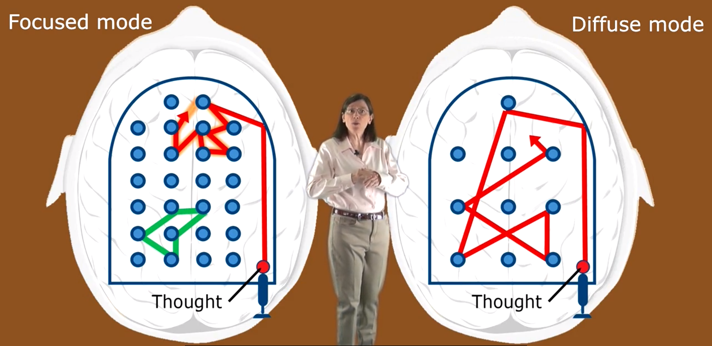

# Introduction

Researchers have found that we have two different modes of thinking

- Focused mode
- Diffused mode

Focused mode is when we concentrate intently when we try to understand or learn something.

Diffused thinking is of relaxed thinking which is related to a set of neural resting states. It should be the type of thinking we need to do when we try to understand something new. This is because the neural resting states that underlie the diffuse mode seem to allow us to cast our thinking much more broadly.

Here we shall understand these modes of thinking by using pinball game as a metaphor and also an analogy.

In focused mode the nodes are closer to each other, in some sense the ball (thought) is traveling along a famililar path. The green path represents neural pattern that requires new ideas or concepts we havent thought of before.

In the diffused mode which is new way of thinking so the thought moves off very widely allowing us to gain new ideas and find new patterns. In diffused mode of thinking we completely we cant focus in as tightly for problem solving or understand the finest aspects of a concept but we get to initial place where we can find a solution.

As far as neuroscientists know we are either in diffused mode or focused mode of thinking. It we can't have both ways of thinking at the same time which kinda like a two sides of a coin.
