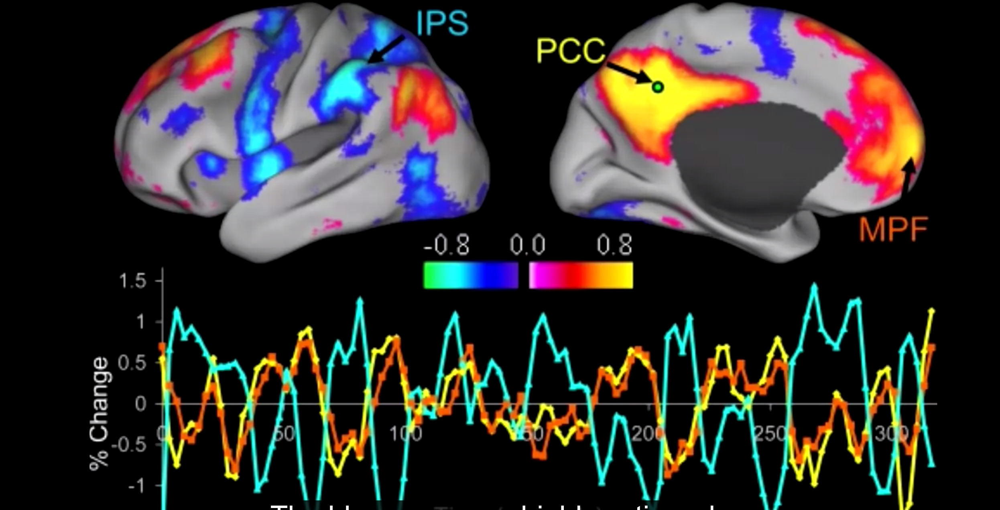

# Lesson 3

## Brain

Brain normally weights 3 pounds but consumes 10 times more energy by weight than any organ in the body. Brains evolved to help us navigate complex environments and most of the heavy lifting is done below the level of consiousness. Psychologists who study the unconscious mind have found that it influcences many things such as thought processes, memory, emotions and motivation.

Here is the image of the brain activity of a person when laying rest. The blue areas represent the brain activity when the person is interacting with the world. The bright yellow and red areas represent the brain activity when the person is relaxing. These active areas are called default mode network.

There are million billions of synapses in the brain that hold the memories. Brain connectivity is found to be dynamic where new connectiosn are constantly formed while some of the connections are broken. New connections between dendrites are formed through synapses when we learn something.
