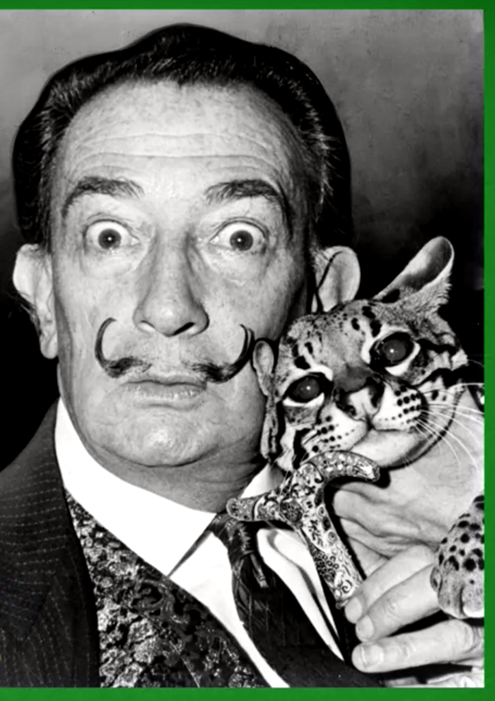

# Lesson 2

## Salvador Dali

Salvador Dali is well known surrealist painter of the 20th century. Dali has a technique that makes him come up with new ideas for his paintings. He would relax in a chair often vaguely thinking about what he has been previously focusing on whith keys in hand and as he would slip into the dreams falling asleep, the keys would fall from his hand and the sound makes him wake up so he could gather his ideas in his mind which came up from diffused mode and off he goes back into focused mode bringing him the connected made in diffused mode.

Similar to Salvador Dali, Thomas Edison who is one of the greatest inventors would also sit in his chair and relax with ball bearings in his hand. When he falls asleep, the sound of those ball bearings that frop from his hand would wake him up and he goes back into focused mode.

So when we are learning something new, we should go back and forth from focused to diffused mode and vice versa.

## Summary

- Metaphors provide powerful techniques for learning.
- Difference between focused and diffused modes.
- Learning something difficult takes time.
