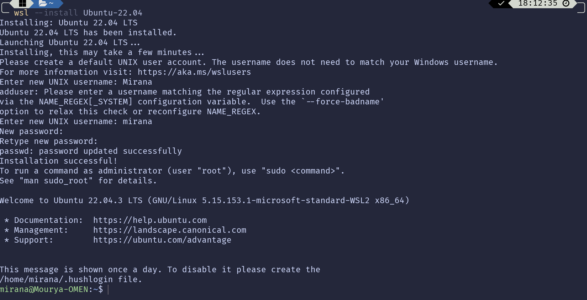

# WSL Installation Instructions

## Steps involved using CLI

1. Enable Virtualization in your BIOS Menu.
2. Click on windows search bar and search **Turn Windows Features On or Off** and open it.
3. It will open a dialog box which contains few features that can be enabled by clicking on the check box. We have to enable **Virtual Machine Platform** and **Windows Subsystem for Linux** and click on OK button. This will install few features that requires restart.
4. Once you restarted the system. Open command prompt or powershell and type:

    ```posh
    wsl --list --online
    ```

5. This will give us a list of distros available that can be downloaded.
6. But before we install a distro, type:

    ```posh
    wsl --update
    ```

    to update the wsl kernel.
7. To install Ubuntu 22.04 we type the command

    ```posh
    wsl --install Ubuntu-22.04
    ```

    (or) `for older versions`

    ```posh
    wsl --install -d Ubuntu-22.04
    ```

8. Installing the ubuntu distro prompts us to create a new user with new UNIX name and a password.
9. Creating a new user with a password sets that new user as default and boots us into ubuntu.

The final result would look like:



Here `mirana` is my username and `Mourya-OMEN` is my device name.
